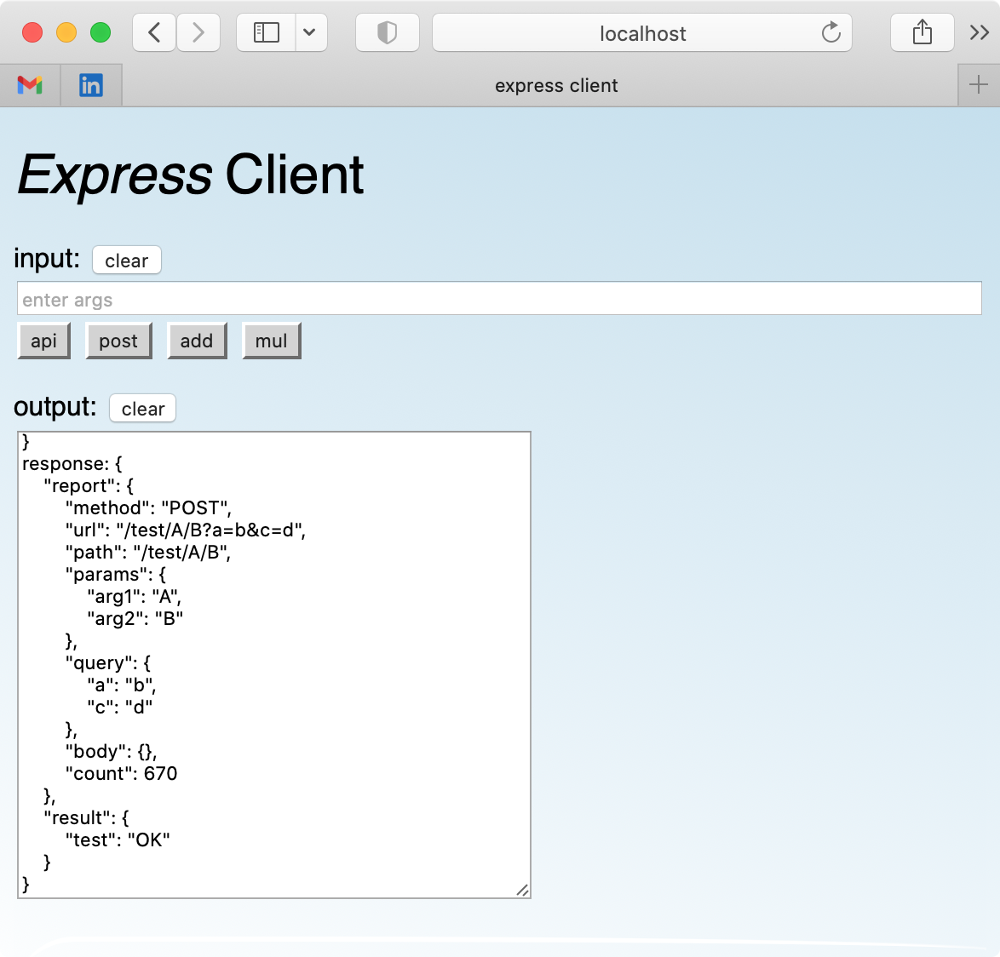
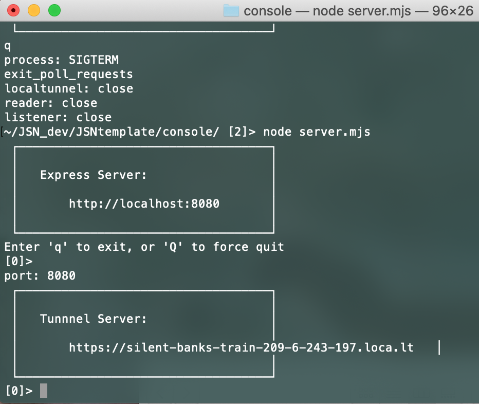
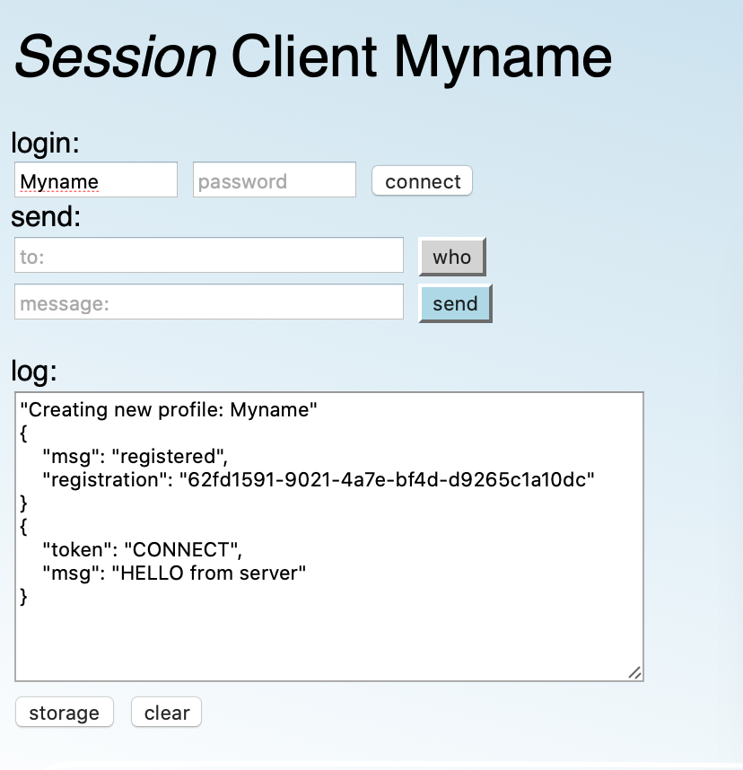

# JSNtemplate

 **Vanilla Node.js Client/Server with RPC and Push**



* Comparing a bare-bones CJS server with full featured 'express' server module and beyond. This is a series of independent client-server web apps, which build progressively on each other by introducing functionality from established node modules.

* These utility templates make implementing a flexible server API an easy task, and demonstrate versatile vanilla RPC (remote procedure) support. With RPC, the challenge was to share a single library source file that both client and server can call, which can create conflicts between CJS and ESM module configurations.

* An interactive server console facilitates development and diagnostics of more complex communication. Clients are identified by simple id and UUID using 'express-request-id', *localtunnel* enables external testing, and push notifications are implemented with both long polling and websocket connections.


| template      | dependencies        | size
| ------------- |:-------------------:|:-------------:|
| *Vanilla*     | node defaults       | 9 KB |
| *Module*      | node defaults       | 9 KB |
| *Express*     | express install     | 1.9 MB |
| *Console*     | request-id install  | 2.1 MB |
| *-tunnel*     | localtunnel install | 3.2 MB |
| *WebSock*     | ws install          | 3.3 MB |


### *Vanilla*

Vanilla just means a 'bare bones' implementation, using older, built-in JavaScript features such as XMLHttpRequest() on the client side, and http.createServer() on the server side.

While there are only a few good reasons to build with what are often deprecated interfaces, they are lightweight, with few dependencies bloating the project with loads of unused features.

More specifically, they illustrate what is really happening behind the scenes when using popular modules like 'express', which hide a lot of complexity while greatly simplifying specific tasks.

There are no packages required other than what Node.js includes by default. One key drawback to the basic http server is that you must explicitly handle any and all GET requests for all types of files.

### *Module*

Converting to strict ESM module specification for import/export, server scripts have been named with the *.mjs* extension. This is deemed preferable to setting a global flag in *package.json*, for backward compatibility with CJS libraries.

### *Express*

As the name suggests, the *Express* app imports the 'express' module which brings with it a lot of essential functionality, like automatic URL query parsing.

The example GET/POST handlers in server.mjs demonstrate parameter passing via traditional query strings, as well as structured URL parameters widely used to implement REST APIs. These are conveniently parsed by the express module.

| param type    | example query      | parsed request inputs
| ------------- |:------------------:|:----------------------------:|
| Query string  | /api?arg1=1&arg2=2 | query: { arg1: 1, arg1: 2 }  |
| URL params    | /api/v1/v2         | params: { arg1: 'v1', arg2: 'v2' }  |

A POST request adds the option to pass arbitrary JSON contents to the server in the request body, without requiring that these parameters be exposed in the URL.


### *Console*

Tha basic *Console* app features an interactive server console, long-poll push notifications, and client to client exchange, including ping pong. Integrating the 'localtunnel' module provides a working external URL for remote testing.


### *Upgrade*

Integrating express WebSocketServer using shared port, and SSL (generates cert errors in Safari).


### *WebSock*

Building a clean, exemplary websocket client to replace fragile long polling and enable faster ping pong.


### *Storage*

TBD: Developing persistent profile and session states using client-side sessionStorage, localStorage, and server-side client profile storage.

The localStorage allocations persist across system reboot, and can quickly become polluted during app testing and development. These can be cleared through the browser's cookies/website-data management tools, listed as 'localhost', 'loca.lt', etc.


### *Session*

Building on *WebSock* message exchange with client-to-client ping pong message protocol. Consideration for persistent client sessions using stored account state (see *Storage* app), to traverse auto-reconnect events.


## Installation

Clone the repo:

```
> git clone https://github.com/mthiebaux/JSNtemplate.git
```

For *Vanilla*, server.js runs right out of the box with Node.js:

```
> cd JSNtemplate/vanilla
> node server.js
```

For *Express*, node will climb up your directory tree looking for package.json files and node_modules/ folders.
If they are not already in your directory path, you can initialize node with the following commands, above or in the express/ folder:

```
> npm init
> npm install express
> node server.mjs
```


## Testing in the Browser

By default, the *Express* server opens on port 8080, which can be changed by passing an optional port number:

```
> node server.mjs 8001
```

Then enter the localhost url in your browser, which will load index.html by default:

```
localhost:8080
```

The testing page runs several test requests on initialization specified in client.js/.mjs:client_app_init(), and the results from the server are written to the output text field. Some results also appear in your browser's JavaScript Console.

You can run similar tests directly by adding URL parameters, and see how the server reports parsed arguments in the command terminal:

```
localhost:8080/api
localhost:8080/api?a=b&c=d
localhost:8080/api/A/B
```

The *api* button will append contents from the input text field to a GET request. Each call to the /api handler (and each press of the button) reads a count value out of ./data.json, increments it, updates the file, and returns that value.

The output response object will report something like the following, mirroring the parsed inputs:

```
response: {
    "method": "GET",
    "url": "/api/A/B?a=b&c=d",
    "path": "/api/A/B",
    "params": {
        "arg1": "A",
        "arg2": "B"
    },
    "query": {
        "a": "b",
        "c": "d"
    },
    "count": 332
}
```


## Testing RPC

The *Express* input text field is set up to add and multiply numbers that you enter. The command and its arguments are sent to the server and executed as an RPC call.

The RPC function response object is written to the output text field, revealing the internals of this client-server exchange. This includes the request report with the body input payload, and the result:

```
response: {
    "report": {
        "method": "POST",
        "url": "/RPC",
        "path": "/RPC",
        "params": {},
        "query": {},
        "body": {
            "rpc": "rpc_process_command",
            "cmd": "add",
            "args": [ 2, 2 ]
        },
        "count": 338
    },
    "result": {
        "value": 4
    }
}
```

The RPC handler simply pulls the function name from the POST request body, checks that it exists as a function, executes it, and adds its return value to the output object:

```
import { rpc_process_command } from './lib.mjs';
let rpc_cmd_map = {};
rpc_cmd_map.rpc_process_command = rpc_process_command;

server.post( '/RPC', ( request, response ) => {

    let output = { report: get_request_report( request ) };
    if( typeof rpc_cmd_map[ request.body.rpc ] === "function" )	{
        output.result = rpc_cmd_map[ request.body.rpc ]( request.body );
    }
    else	{
        let msg = "RPC: function \'" + request.body.rpc + "\' NOT FOUND";
        output.result = { error: msg };
    }
    response.send( output );
});
```


## Testing the Console

The *Console* app requires some extra modules, to uniquely identify each client with UUID, and to generate a public URL using localtunnel:

```
> npm install express-request-id
> npm install localtunnel
```

The server console has several commands to track clients and their long poll status, and a dummy push message which clients will report:

```
> who
{ id: 0, uuid: 'e39e3735-5827-492d-915b-f39ddeebccc5' }
{ id: 1, uuid: '3e0630ff-16e1-4db9-a0c6-942e06909046' }
{ id: 2, uuid: '6ffe4628-252c-4b42-b5ae-2ea7700f72b3' }

> poll
{ id: 0, uuid: 'e39e3735-5827-492d-915b-f39ddeebccc5' }
{ id: 2, uuid: '6ffe4628-252c-4b42-b5ae-2ea7700f72b3' }

> push
>
```

Multiple clients can now see other public client names (simple integer id), using the *who* button:

```
response: {
    "report": {
        "method": "GET",
        "url": "/who",
        "path": "/who",
        "params": {},
        "query": {},
        "body": {}
    },
    "clients": [ 0, 1, 2 ],
    "current": [ 0, 2 ]
}
```


A message can be sent to an array of clients using ':' to parse the input buffer into a list of ids and a text payload, and pressing the *send* button (or Enter key):

```
0 1 2 : - stuff-
```

The *send* button will push the input buffer contents to the specified array of clients over their long polling channel, which uses 'status' to detect graceful or hard server termination:

```
response: {
    "status": true,
    "report": { ... },
    "payload": {
        "from": 1,
        "to: [ 0, 1, 2 ],
        "text": " - stuff- "
    }
}
```

If the server is restarted, a client can reconnect using the *conn* button and will receive a new id. The client's *push* button will submit a request to the server to push a token to all current clients, updating the long poll queue.


### *Ping Pong*

A client can initiate a ping pong session with any other clients by issuing a 'ping' message. For example, client 0 issues the following to client 1:

```
1: ping
```

Client 1 automatically responds with a 'pong' message, entering into a loop with client 0 (with a 1 second delay), until either client tells the other to stop:

```
1: stop
```

Once stopped, the client will not join a loop again until it receives a 'start' message:

```
1: start
```


### *Localtunnel*

The *Console* app automatically sets up a localtunnel URL for public access to the client, using port 8080. When the server is running, the client can access it directly via a sharable, auto-generated URL resembling the following:

```
https://silent-banks-train-209-6-243-197.loca.lt
```

The port and tunnel URL can be changed using commandline arguments as follows:

```
> node server.mjs 8001 myuniquesubdomain
```




## Testing WebSock

* The *WebSock* app requires one extra lightweight module to support sockets in conjunction with localtunnel:

```
> npm install ws
```

* Each client initiates *WebSock* registration by submitting a GET '/register' request to the server using fetch(). The server responds with a new id and uuid:

```
{
    "report": {
        "method": "GET",
        "url": "/register",
        "path": "/register",
        "params": {},
        "query": {},
        "body": {}
    },
    "client": {
        "id": 0,
        "uuid": "50d59cf3-13d5-46bf-85da-bdbb109232e8"
    }
}
```

* Once a socket opens, the client begins exchanging socket messages using the *token* property for message routing, beginning with 'REGISTER' plus client identifiers to complete client-socket registration:

```
socket.send(
    JSON.stringify(
        {
            token: "REGISTER",
            client: {
                id: 0,
                uuid: "50d59cf3-13d5-46bf-85da-bdbb109232e8"
            }
        }
    )
);
```

* This two step process ensures that the server's socket connection handlers are mapped to the correct client identifiers, to maintain two-way push communication and forwarding.

* Each *WebSock* channel is kept open against network timeouts using hidden POKE and ALIVE tokens. Each client uses hidden PING/PONG tokens to detect an unresponsive server, and re-register if necessary.

* Auxiliary client buttons are used to analyze fault tolerance procedures, server restart, etc:

    * *rld* will reload entire page from server, acquiring a new id.
    * *reg* will re-register existing page with server, with new id.
    * *sock* will reconnect with a new socket using existing id.

* The client's *who* button logs the server's active client list, and the *poke* button logs client 'alive' response tokens.

* The client text input fields accept a list of integer client ids, and an arbitrary text message for forwarding to peers, using the *send* button.

* The server console allows inspection of the client connections with the *who* command:

```
> who
registered clients:
{ id: 0, uuid: 'cab5b616-2f15-46de-a9e9-4b30c10f08e8' }
{ id: 1, uuid: 'bd4f5363-d040-40a1-9708-b15717d1f75d' }
{ id: 2, uuid: '6d1c1cf7-dac5-4543-8613-727215278464' }
connected clients:
{ id: 1, uuid: 'bd4f5363-d040-40a1-9708-b15717d1f75d' }
{ id: 2, uuid: '6d1c1cf7-dac5-4543-8613-727215278464' }
```

## Testing Session




