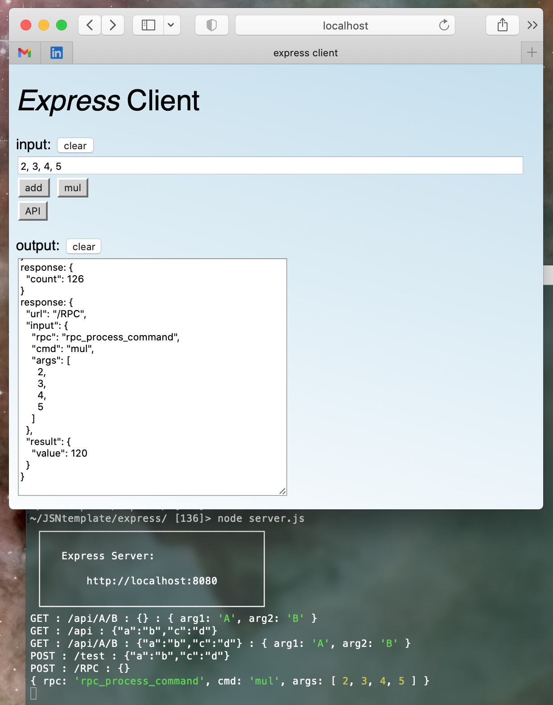

# JSNtemplate

 **Vanilla JS Client/Server with RPC**

* Comparing a bare-bones CJS server with full featured 'express' server module

* This utility template makes implementing a server API very easy, and demonstrates versatile vanilla RPC (remote procedure) support.

* While calling a remote procedure by routed key is not difficult, the challenge was to share a single library source file that both client and server can call. The function name is passed through a POST body.

| template      | dependencies |
| ------------- |:-------------:|
| Vanilla       | node defaults |
| Module        | package.json file |
| Express       | express install |


## *Vanilla*

Vanilla just means a 'bare bones' implementation, using older, built-in JavaScript features such as XMLHttpRequest() on the client side, and http.createServer() on the server side.

While there may not be a good reason to build with what are often deprecated utilities, they are lightweight, often with no dependencies bloating the project with loads of unused features.

More specifically, they illustrate what is really happening behind the scenes when using popular modules like 'express', which hide a lot of complexity while greatly simplifying specific tasks.

Adhering to this tenet, the initial Common JS app does not use JS modules, and so the RPC callback can't be shared.

One key drawback to the basic http server is that you must explicitly handle any and all GET requests for all types of files.

## *Module*

The Module app is essentially the same as Vanilla, but includes a regular package.json text file with a single entry added: { "type": "module", } to enable sharing the RPC library file.

Despite the name, there is no node_modules/ folder needed, and no packages required other than what Node.js includes by default.

## *Express*

As the name suggests, the Express app imports the 'express' module which brings with it a LOT of essential functionality, like 'fs' for reading and writing files.

The example GET handlers in server.js demonstrate parameter passing via traditional query strings, as well as structured URL parameters widely used to implement REST APIs. These are conveniently parsed by the express module.

| param type     | example query |
| -------------- |:-------------:|
|  Query string  | /api?var1=val1&var2=val2 |
|  URL params    | /api/val1/val2 |

The POST request adds the option to pass arbitrary JSON contents to the server in the request body, without requiring these parameters to be exposed in the URL. This is the method used to implement the RPC call.


## Installation

For Vanilla and Module, these will run right out of the box with node.js:

```
> node server.js
```

For Express, node.js will climb up your directory tree looking for your package.json file and node_modules/ folder, so put the directory somewhere under these.

Otherwise, you can initialize node with the following commands, directly above or in the express/ folder if you like:

```
> npm init
> npm install express
```

## Testing in the Browser

By default, server.js opens on port 8080, which can be changed by passing an optional port number:

```
> node server.js 8000
```

Now just enter the localhost url in your browser, which will load index.html by default:

```
localhost:8080
```

The testing page runs several test requests on initialization specified in client.js:client_app_init(), and the results from the server are written to the large output text field. Some results also appear in your browser's JavaScript Console.

You can run also similar tests directly by adding URL parameters, and see how the server parses the arguments in the command console:

```
localhost:8080/api
localhost:8080/api?a=b&c=d
localhost:8080/api/A/B
```

Each call to the /api handler (and each press of the API button) reads a count value out of ./data.json, increments it, updates the file, and returns that value.

## Testing RPC

The input text field is set up for adding and multiplying numbers that you enter. The command and its arguments are sent to the server and executed as an RPC call.

The response text is written to the client-page output field, revealing the internals of this client-server exchange.




